# 🖥️ Sistema de Gestão de TI — Python + Flask + MySQL

> Sistema web desenvolvido para centralizar e digitalizar processos de gestão de infraestrutura de TI, substituindo controles anteriormente realizados por meio de planilhas e processos manuais.

---

## 🛠️ Tecnologias


---

## 📌 Sobre o projeto

O **Sistema de Gestão de TI** foi desenvolvido durante minha atuação profissional na área de Tecnologia da Informação, com o objetivo de centralizar informações e facilitar o gerenciamento dos recursos de TI da empresa.

A solução reúne diferentes processos em uma única aplicação, permitindo maior organização das informações, acompanhamento das atividades e geração de relatórios e indicadores.

O projeto também contempla recursos de **automação** e **Inteligência Artificial**, aplicados conforme as necessidades dos processos.

> 🔒 **Importante:** este repositório é destinado exclusivamente à apresentação do projeto. Por se tratar de uma solução corporativa, o código-fonte original e os dados reais da empresa não estão disponíveis publicamente.

---

## 📸 Interface do sistema

### Tela de Login

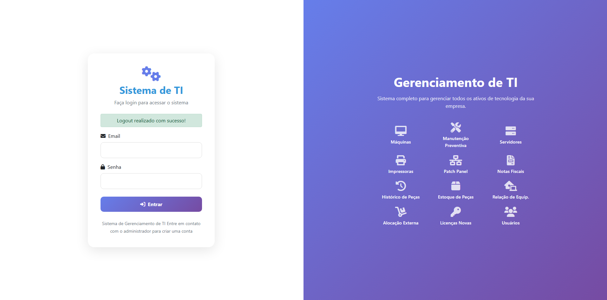

### Dashboard

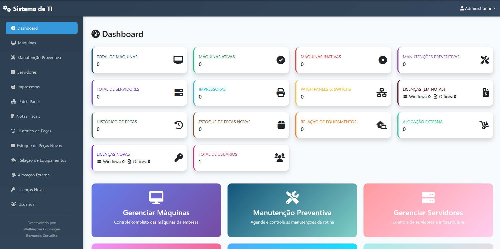

### Máquinas

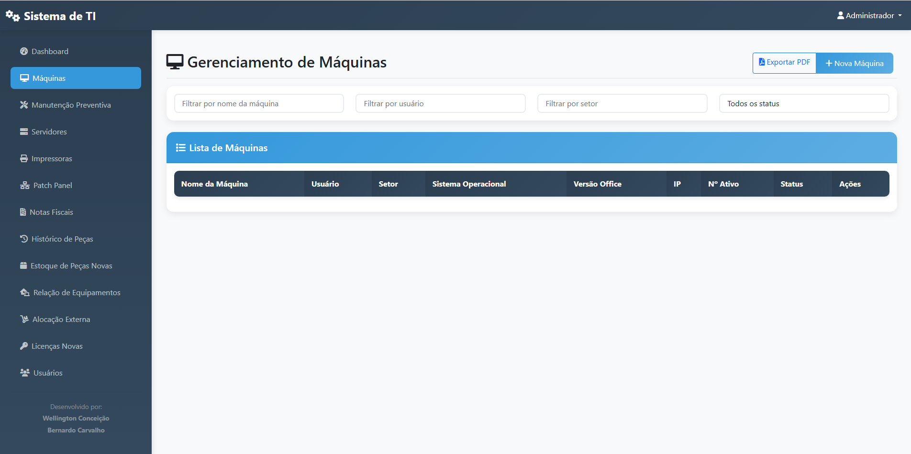

### Manutenção Preventiva

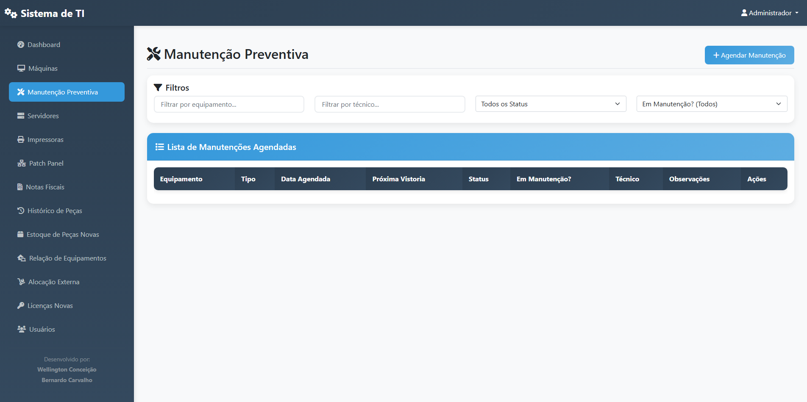

### Servidores

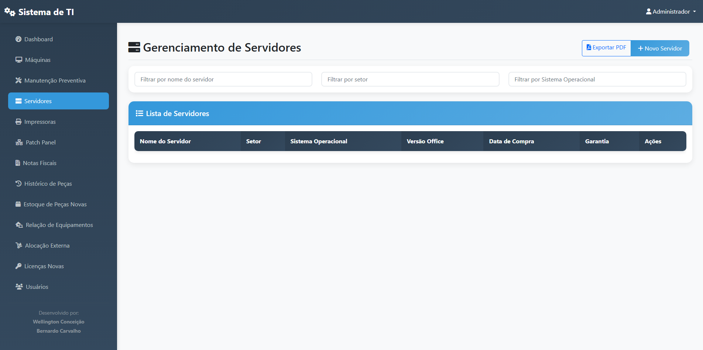

### Impressoras

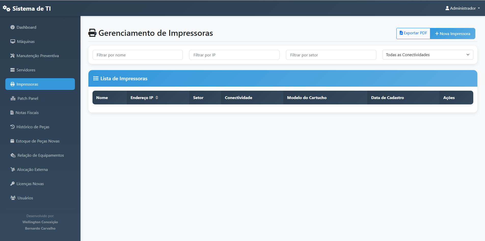

### Patch Panel

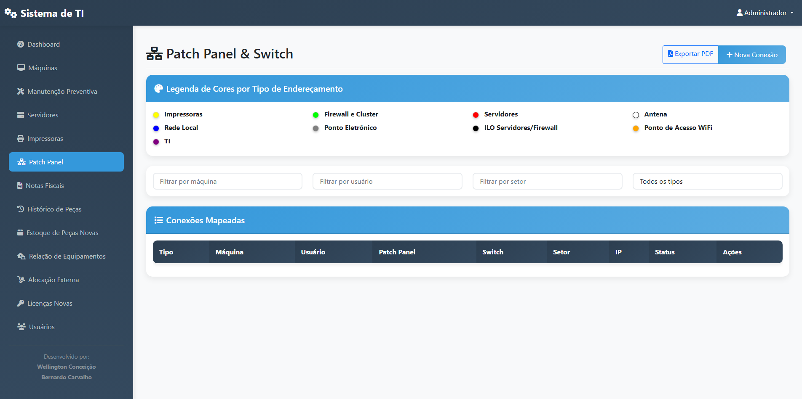

### Notas Fiscais

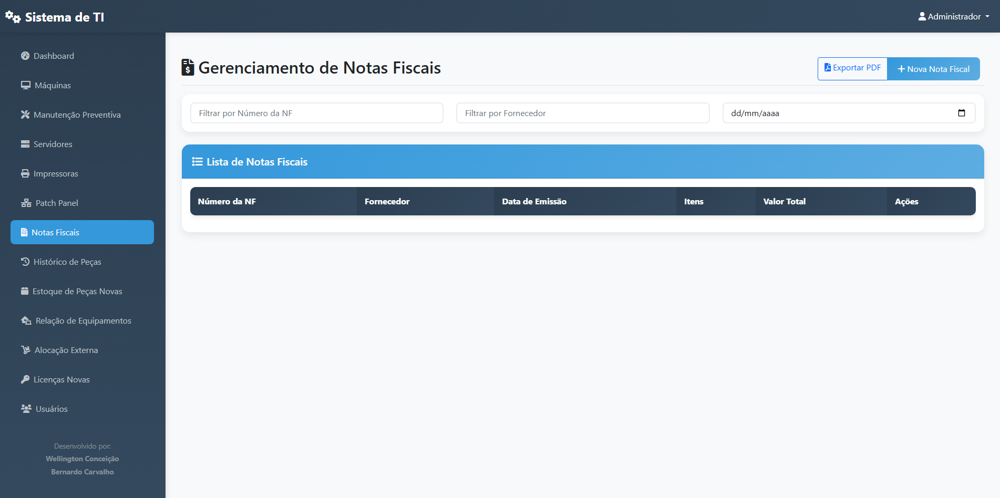

### Histórico de Peças

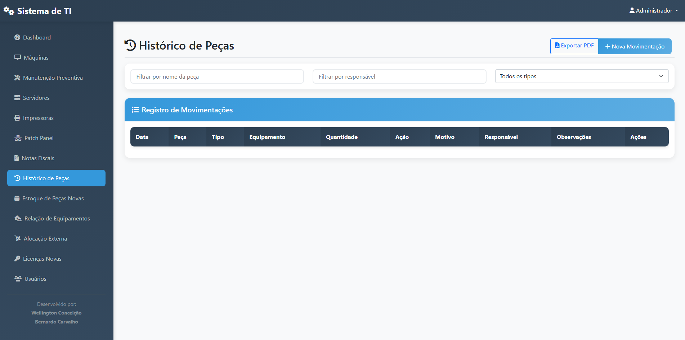

### Estoque de Peças Novas

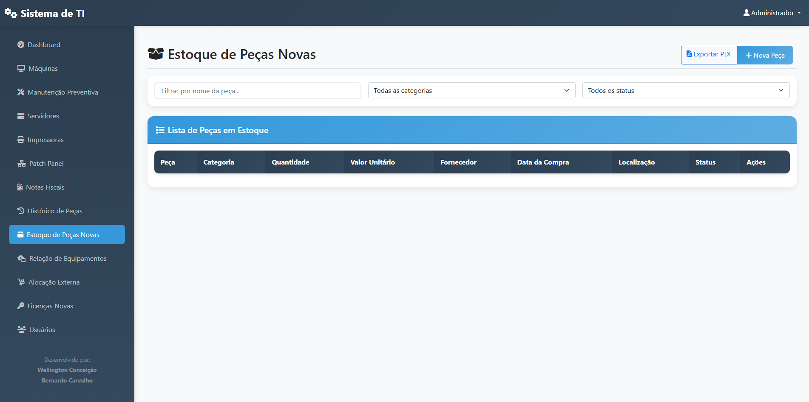

### Relação de Equipamentos

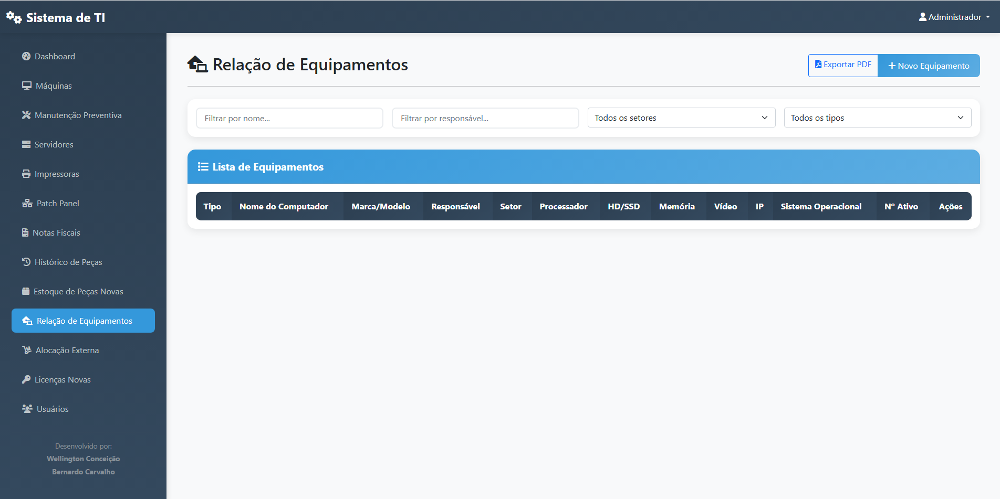

### Alocação Externa

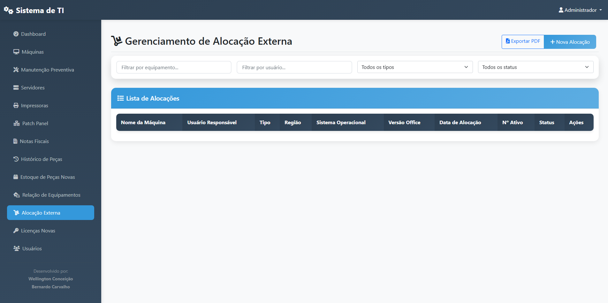

### Licenças Novas

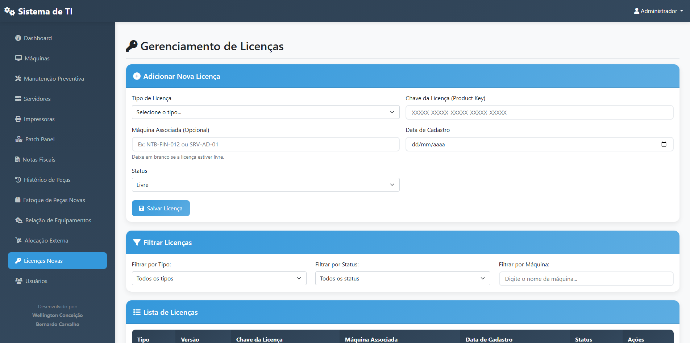

### Usuários

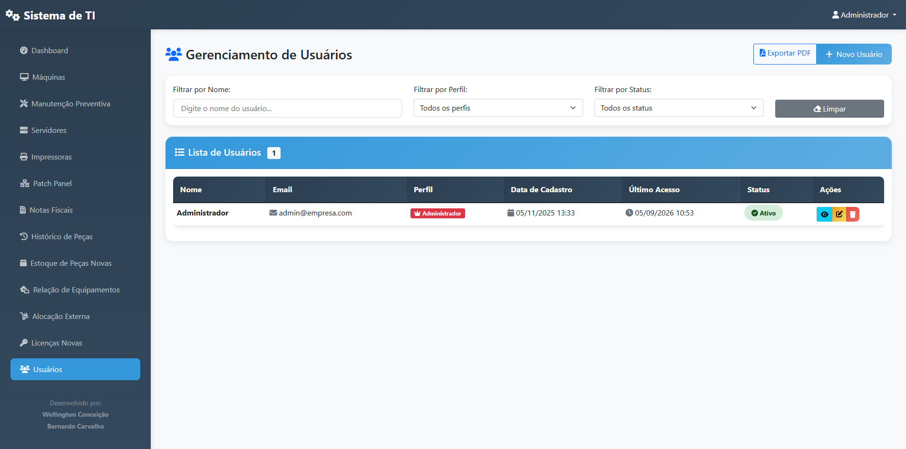


---

## 👨‍💻 Minha atuação

Durante o desenvolvimento da solução, atuei na análise das necessidades do ambiente de TI e na transformação dos processos existentes em funcionalidades do sistema.

Entre as atividades envolvidas:

- Levantamento de necessidades junto aos usuários
- Análise e digitalização de processos
- Desenvolvimento utilizando Python e Flask
- Utilização de MySQL para armazenamento das informações
- Desenvolvimento de funcionalidades para gestão de equipamentos
- Implementação de controles e automações
- Desenvolvimento de dashboards e relatórios
- Manutenção e evolução da solução

---  

## 🎯 Objetivos

- Centralizar informações relacionadas à infraestrutura de TI
- Digitalizar processos anteriormente controlados por planilhas
- Automatizar atividades operacionais
- Facilitar o acompanhamento através de dashboards e relatórios

---

## ⚙️ Principais funcionalidades

### 💻 Gestão de equipamentos
- Cadastro e gerenciamento de equipamentos
- Inventário de máquinas
- Coleta de informações dos computadores
- Controle de equipamentos alocados fora da empresa
- Histórico de informações

### 🔧 Manutenção
- Controle de manutenção preventiva
- Acompanhamento de equipamentos
- Histórico de manutenções
- Registro de peças utilizadas

### 🖥️ Infraestrutura
- Gestão de servidores
- Informações dos equipamentos
- Controle de impressoras
- Acompanhamento de recursos de TI

### 🔑 Licenciamento
- Controle de licenças de software
- Organização das informações de licenciamento

### 📦 Estoque
- Controle de peças
- Registro de movimentações
- Histórico de utilização

### 📊 Dashboards e relatórios
- Visualização centralizada das informações
- Indicadores para acompanhamento dos processos
- Geração de relatórios para apoio à tomada de decisão

### 🤖 Automação e IA
- Automação de atividades operacionais
- Utilização de recursos de Inteligência Artificial em processos específicos

---

## 🏗️ Arquitetura

A aplicação foi estruturada utilizando uma arquitetura web baseada em:

```text
Usuário
   │
   ▼
Interface Web
HTML + CSS + JavaScript
   │
   ▼
Flask / Python
   │
   ├── Regras de negócio
   ├── Automação
   └── Recursos de IA
   │
   ▼
MySQL

---

## 🔒 Segurança e confidencialidade

Este projeto foi desenvolvido em ambiente corporativo. Por esse motivo, o código-fonte original, dados reais, informações de usuários, infraestrutura e demais informações confidenciais não são disponibilizados publicamente.

O repositório tem como objetivo apresentar o contexto do projeto, suas funcionalidades, tecnologias utilizadas e minha experiência no desenvolvimento da solução.
